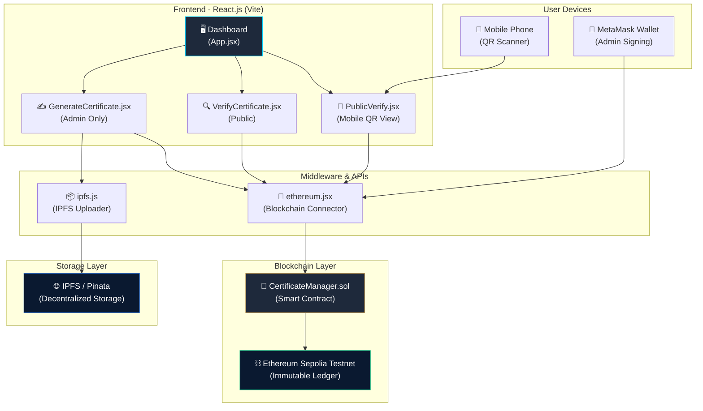
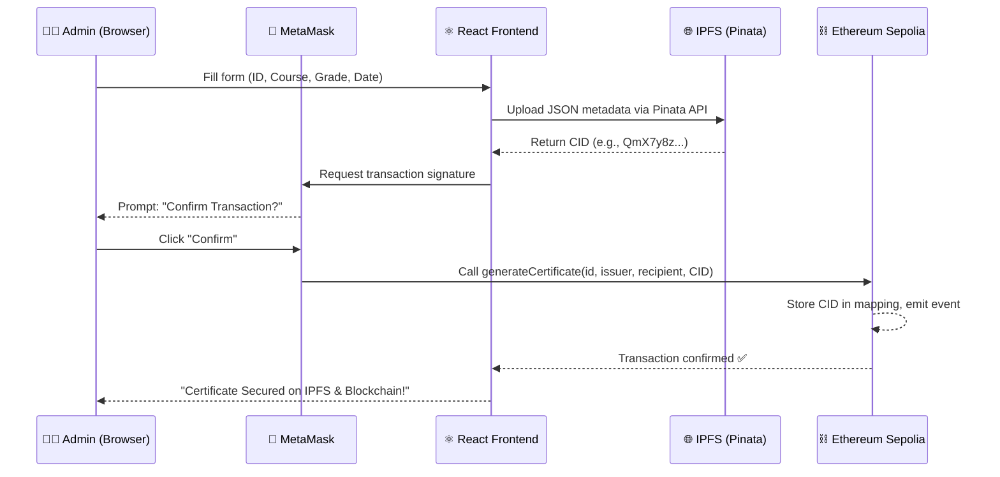
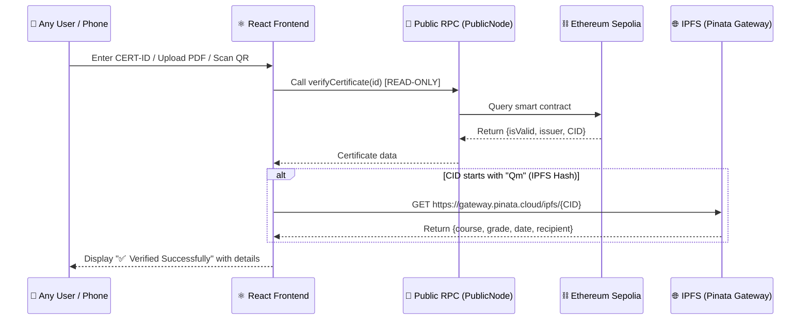

# 🛡️ CertiSafe — Complete Project Documentation

> **Decentralized Blockchain-Based Certificate Verification System**
> Built on Ethereum Sepolia Testnet | IPFS via Pinata | React.js Frontend

---

## 📌 Problem Statement

**Certificate fraud is a global problem.** Traditional paper-based and even digitally-signed certificates can be forged, duplicated, or tampered with. Employers and universities have no quick, reliable way to verify the authenticity of a candidate's academic credentials.

### The Core Issues:
1. **Forgery**: Paper certificates and PDFs can be easily edited and faked.
2. **Centralized Databases**: University databases can be hacked, altered, or even go offline permanently.
3. **Slow Verification**: Manually contacting an institution to verify a degree takes days or weeks.
4. **No Universal Standard**: Every institution uses its own format, making cross-verification nearly impossible.

### Our Solution:
**CertiSafe** uses the **Ethereum Blockchain** to create an **immutable, tamper-proof** digital record for every certificate. Once a certificate is issued, its record can **never be altered or deleted** — not even by the issuer. Anyone in the world can verify a certificate instantly by scanning a QR code or entering the Certificate ID.

---

## 🏗️ Architecture Diagram



---

## 🔄 Sequence Diagram — Certificate Issuance Flow



---

## 🔄 Sequence Diagram — Certificate Verification Flow



---

## 🧰 Technology Stack — Why Each Tool?

| Technology | Role | Why We Chose It |
|:---|:---|:---|
| **Solidity** | Smart Contract Language | The industry standard for Ethereum smart contracts. Allows us to define immutable business logic. |
| **Hardhat** | Development Framework | Provides compilation, testing, deployment, and debugging tools for Solidity. Better than Truffle for modern workflows. |
| **Ethereum Sepolia** | Testnet | A public Ethereum test network. Free to use (no real ETH needed), but behaves identically to Mainnet. Perfect for demos. |
| **React.js** | Frontend Framework | Component-based architecture makes it easy to build interactive UIs. Industry standard for web apps. |
| **Vite** | Build Tool | 10x faster than Webpack. Instant hot-reload during development. Modern ES module support. |
| **Ethers.js v6** | Blockchain Interaction | The most popular library to interact with Ethereum. Handles wallet connections, transaction signing, and contract calls. |
| **IPFS (Pinata)** | Decentralized Storage | Storing full certificate data on-chain is expensive (gas fees). IPFS stores the data for free, and we only store the tiny hash (CID) on-chain. |
| **MetaMask** | Wallet | The most widely-used Ethereum wallet. Acts as the "key" for the admin to sign transactions. |
| **React Router** | Deep Linking | Enables unique URLs like `/verify/CERT-123` so QR codes can link directly to a specific certificate's verification page. |
| **html2canvas + jsPDF** | PDF Generation | Converts the on-screen certificate card into a high-resolution downloadable PDF. |
| **pdfjs-dist** | PDF Parsing | Extracts text from uploaded PDFs to find the Certificate ID for automatic verification. |
| **Render** | Hosting | Free static site hosting with automatic GitHub deployments. Perfect for student projects. |

---

## 📂 Project Structure — Key Files to Open & Explain

```
CertifiacateVerification/
│
├── contracts/
│   └── 📜 CertificateManager.sol     ← THE SMART CONTRACT (Heart of the project)
│
├── hardhat.config.js                 ← Blockchain deployment configuration
│
├── ignition/                         ← Hardhat Ignition deployment scripts
│
├── Frontend/
│   ├── .env                          ← Secret keys (NEVER pushed to GitHub)
│   ├── .env.example                  ← Template for teammates
│   │
│   └── src/
│       ├── App.jsx                   ← Main app with routing (Dashboard + QR routes)
│       ├── App.css                   ← All styling (sidebar, certificate, mobile)
│       │
│       ├── components/
│       │   ├── ethereum.jsx          ← Blockchain connector (MetaMask + Public RPC)
│       │   ├── GenerateCertificate.jsx  ← Admin form to issue certificates
│       │   ├── VerifyCertificate.jsx    ← Verify by ID or PDF upload
│       │   ├── PublicVerify.jsx         ← Mobile QR scan verification page
│       │   └── CertificateManager.json  ← Contract ABI (auto-generated)
│       │
│       └── utils/
│           └── ipfs.js               ← IPFS upload logic via Pinata
```

---

## 🔬 Deep Dive — File-by-File Explanation

### 1. 📜 `CertificateManager.sol` — The Smart Contract
> [Open File](file:///home/harsha/BlockChain/CertifiacateVerification/contracts/CertificateManager.sol)

This is the **heart of the entire project**. It runs on the Ethereum blockchain and can never be modified after deployment.

**Key Concepts to explain:**
- **`struct Certificate`** (Line 5-11): Defines the data structure — id, issuer, recipient address, data (IPFS CID), and validity flag.
- **`mapping(string => Certificate)`** (Line 19): A hash-table that maps each Certificate ID to its data. This is how we "look up" certificates.
- **`onlyOwner` modifier** (Line 27-30): Restricts `generateCertificate()` to only the deployer's wallet address. No one else can issue certificates.
- **`generateCertificate()`** (Line 36-48): Creates a new certificate. Stores the IPFS CID in the `data` field. Emits an event.
- **`verifyCertificate()`** (Line 53-60): A `view` function (costs zero gas). Anyone can call it to check if a certificate exists.

> [!IMPORTANT]
> **Reviewer Question**: "Why store the IPFS hash instead of the actual data?"
> **Answer**: Storing data on Ethereum costs gas (real money). A single string costs ~$0.10-$5.00 depending on length. An IPFS hash is only 46 characters — the cheapest possible storage. The full metadata lives on IPFS for free.

---

### 2. 🔗 `ethereum.jsx` — The Blockchain Connector
> [Open File](file:///home/harsha/BlockChain/CertifiacateVerification/Frontend/src/components/ethereum.jsx)

This file handles **two modes of blockchain access**:

- **`needSigner = true`** → Connects via MetaMask (for admins who need to WRITE to the blockchain).
- **`needSigner = false`** → Connects via a free public RPC endpoint (for anyone who just wants to READ/verify). **No wallet needed.**

> [!TIP]
> **Reviewer Question**: "Why two modes?"
> **Answer**: Writing to the blockchain (issuing a certificate) requires a transaction, which costs gas and needs a wallet signature. But READING is free and doesn't need a wallet. This dual-mode design allows phones without MetaMask to still verify certificates.

---

### 3. 📦 `ipfs.js` — IPFS Upload Logic
> [Open File](file:///home/harsha/BlockChain/CertifiacateVerification/Frontend/src/utils/ipfs.js)

This utility sends the certificate JSON metadata to **Pinata's IPFS pinning service**. Pinata ensures the data stays permanently available on the IPFS network.

**Key flow:**
1. Takes a JavaScript object (course, grade, date, etc.)
2. POSTs it to Pinata's `/pinJSONToIPFS` endpoint with JWT authentication.
3. Returns the **CID** (Content Identifier) — a unique hash like `QmX7y8z...`

> [!IMPORTANT]
> **Reviewer Question**: "What is IPFS?"
> **Answer**: IPFS (InterPlanetary File System) is a decentralized, peer-to-peer file storage network. Unlike AWS S3 or Google Drive, no single company controls the data. Files are addressed by their content hash, meaning if even one byte changes, the hash changes — making tampering detectable.

---

### 4. ✍️ `GenerateCertificate.jsx` — Admin Issuance Form
> [Open File](file:///home/harsha/BlockChain/CertifiacateVerification/Frontend/src/components/GenerateCertificate.jsx)

The admin-only form that issues new certificates. The flow is:

```
Fill Form → Upload to IPFS → Get CID → Store CID on Blockchain via MetaMask
```

**Important lines to highlight:**
- **Line 19-22**: Auto-generates a unique Certificate ID like `CERT-X7Y2Z9`.
- **Line 34-43**: Prepares the metadata JSON object for IPFS.
- **Line 47**: Calls `uploadToIPFS()` — the metadata is now on IPFS.
- **Line 56**: Calls the smart contract's `generateCertificate()` — the CID is now on Ethereum.

---

### 5. 🔍 `VerifyCertificate.jsx` — Verification Portal
> [Open File](file:///home/harsha/BlockChain/CertifiacateVerification/Frontend/src/components/VerifyCertificate.jsx)

The most feature-rich component. Supports **three verification methods**:

1. **Enter ID** — Type the Certificate ID manually.
2. **Upload PDF** — Upload a previously downloaded certificate PDF. The app extracts the ID and auto-verifies.
3. **QR Scan** — Handled by `PublicVerify.jsx` (see below).

**Key concepts:**
- **Lines 62-103**: PDF parsing logic using `pdfjs-dist`. Extracts text from the PDF, searches for `CERT-XXXXX` pattern.
- **Lines 85-91**: Filename fallback — if the PDF is image-based, falls back to parsing the filename (`Certificate-CERT-XT1FPEN0.pdf`).
- **Lines 43-47**: Embeds the Certificate ID as real text in generated PDFs so future uploads can find it.

---

### 6. 📱 `PublicVerify.jsx` — Mobile QR Verification
> [Open File](file:///home/harsha/BlockChain/CertifiacateVerification/Frontend/src/components/PublicVerify.jsx)

A dedicated, **mobile-optimized** page. When someone scans the QR code on a certificate:

1. The URL `/verify/CERT-X7Y2Z9` opens this component.
2. It auto-extracts the ID from the URL.
3. Connects to the blockchain via the **public RPC** (no MetaMask needed).
4. Fetches the full details from IPFS.
5. Displays a clean **"✅ Verified Successfully"** card with all details.

> [!TIP]
> **Reviewer Question**: "Can this work on any phone?"
> **Answer**: Yes! Unlike the admin portal which needs MetaMask, the public verification page uses a free public Ethereum RPC. Any phone with a browser can verify a certificate.

---

### 7. 🎨 `App.jsx` — Application Router
> [Open File](file:///home/harsha/BlockChain/CertifiacateVerification/Frontend/src/App.jsx)

Manages two routes:
- **`/`** → The full admin dashboard (sidebar + issue/verify tabs).
- **`/verify/:id`** → The mobile-friendly public verification page.

Also includes **admin detection**: checks if the connected MetaMask wallet matches the owner's address (`0x5bD...`), and shows "Admin Authorized" or "Guest Mode".

---

### 8. ⚙️ `hardhat.config.js` — Deployment Configuration
> [Open File](file:///home/harsha/BlockChain/CertifiacateVerification/hardhat.config.js)

Configures Hardhat to:
- Compile Solidity `0.8.24`
- Deploy to **Sepolia testnet** via Infura RPC
- Uses `hardhat vars` to securely store the Infura API Key and MetaMask private key (never in code)

---

## 🔐 Security Architecture

| Threat | Protection |
|:---|:---|
| **Certificate Forgery** | Blockchain immutability — once written, data cannot be changed. |
| **Unauthorized Issuance** | `onlyOwner` modifier — only the deployer's wallet can issue certificates. |
| **API Key Leakage** | Environment variables (`import.meta.env.VITE_*`) — keys never appear in source code. `.env` is in `.gitignore`. |
| **Data Tampering on IPFS** | Content-addressed storage — the CID is derived from the content. Any change produces a different CID, which won't match the on-chain record. |
| **IPFS Data Loss** | Pinata pinning service keeps the data permanently available across the IPFS network. |

---

## 🎯 Potential Reviewer Questions & Answers

### Q1: "Why not store everything on the blockchain?"
**A:** Storing data on Ethereum costs gas (real money). A single transaction storing 1 KB of data can cost $5-$50 on mainnet. By storing only the 46-character IPFS CID on-chain, we reduce costs by ~99% while maintaining the same security guarantee.

### Q2: "What happens if Pinata goes down?"
**A:** The data is on the IPFS **network**, not just on Pinata's servers. Any IPFS node that has pinned the data can serve it. We could switch to another pinning service (Infura IPFS, web3.storage) without changing the CID.

### Q3: "Is this production-ready?"
**A:** The architecture is production-ready. For a real deployment, we would:
1. Deploy to Ethereum Mainnet (instead of Sepolia testnet).
2. Add role-based access control (multiple admin addresses).
3. Add certificate revocation functionality.
4. Use a custom domain for the Render site.

### Q4: "How is this different from a simple database?"
**A:** 
- A database is **centralized** — the admin can modify or delete records.
- The blockchain is **decentralized** — once written, even the admin cannot alter the data.
- The blockchain provides a **public audit trail** — anyone can verify the history of transactions.

### Q5: "What is the gas cost of issuing one certificate?"
**A:** On Sepolia (testnet), it's free (test ETH). On Ethereum Mainnet, it would cost approximately **~0.001-0.003 ETH** (~$2-$8 USD at current prices) per certificate.

### Q6: "How does the QR code work without MetaMask on a phone?"
**A:** The `ethereum.jsx` file has a **dual-mode connector**. For verification (read-only), it connects via a free public RPC endpoint (`ethereum-sepolia-rpc.publicnode.com`). No wallet, no login, no MetaMask required. Only writing (issuing certificates) requires MetaMask.

---

## 🌐 Live URLs

| Resource | Link |
|:---|:---|
| **Live App** | [https://educhain-zvwl.onrender.com](https://educhain-zvwl.onrender.com) |
| **GitHub** | [https://github.com/HarshaUndodi/BC-CertificateVerification](https://github.com/HarshaUndodi/BC-CertificateVerification) |
| **Smart Contract on Etherscan** | [View on Sepolia Etherscan](https://sepolia.etherscan.io/address/0xd9Cd2980969dCA1db4804c4cCC4033c9F7D38680) |
| **Admin Wallet** | `0x5bD0005b3ee7e7a64425d1838396DD5de9122078` |

---

## 📋 How to Demo (Step-by-Step)

### Demo 1: Issue a Certificate
1. Open the live app on a computer with MetaMask installed.
2. Switch to **"Issue Certificate"** tab.
3. Click **"Generate"** to create a unique ID.
4. Fill in: Institution, Recipient Wallet, Course, Grade, Date.
5. Click **"Mint & Secure Credential"**.
6. **Show MetaMask popup** → Explain: "This is the admin signing the transaction."
7. Wait for confirmation → **Show the IPFS CID** in the alert.

### Demo 2: Verify a Certificate
1. Switch to **"Verify Credential"** tab.
2. Enter the Certificate ID → Click **"Verify"**.
3. **Show the official certificate card** with the gold seal and QR code.
4. Click **"Download Official PDF"** → Show the downloaded file.

### Demo 3: QR Code Scan
1. Open your phone's camera.
2. Point it at the QR code on the certificate.
3. **Show the phone screen** → "✅ Verified Successfully" with all details.
4. **Key point**: "No MetaMask needed on the phone!"

### Demo 4: PDF Upload Verification
1. Switch to **"Upload PDF"** tab.
2. Upload the previously downloaded certificate.
3. Show: "✅ Found ID: CERT-XXXXX — Verifying on Blockchain..."
4. Certificate appears automatically.

### Demo 5: Show Etherscan
1. Open the Etherscan link.
2. Show the **transaction history** — every certificate issuance is permanently recorded.
3. Click on a transaction → Show the **input data** (the IPFS CID stored on-chain).

---

## 🏆 What Makes This Project Stand Out

1. **Not Just a CRUD App** — Uses real blockchain technology with actual deployed smart contracts.
2. **Hybrid Storage Architecture** — Combines on-chain (Ethereum) and off-chain (IPFS) storage for optimal cost and security.
3. **Production-Grade Security** — Environment variables, access control, public/private provider separation.
4. **Real-World Use Case** — Certificate fraud is a genuine problem solved by this technology.
5. **Full End-to-End Flow** — From issuance to QR verification to PDF export — a complete product, not a prototype.

---

*Document prepared for the CertiSafe team — May 2026*
